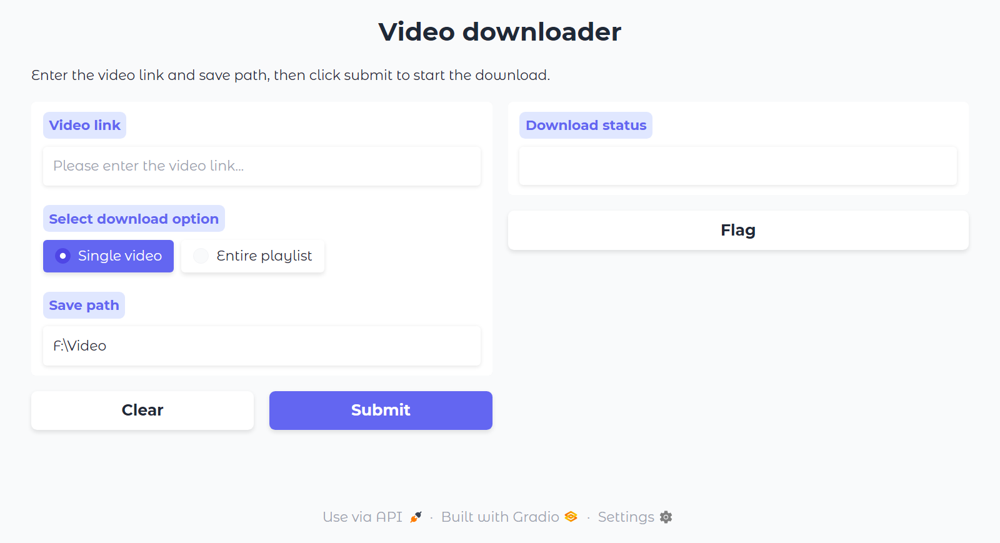

# Usage

Windows: Double-click `run.bat` to automatically open a web interface for downloading videos. Just paste various video links into it.




# With Proxy

Due to issues in Mainland China, a proxy is required for accessing many online video platforms.

So if you need a proxy, please add the proxy parameter.

`config.py`

```python
# Use a dictionary to store configuration
config = {
    'DIR': "F:\Video",
    'PROXY': 'http://127.0.0.1:4343',
}
```

# NO Proxy

If you can directly connect to all video platforms, you do not need to use the `proxy` parameter.So you need to remove the proxy parameter.

`config.py`

```python
config = {
    'DIR': "F:\Video",
}
```

# Video Platforms

supported for download (as tested):

- youtube


- tiktok


- bilibili


- pornhub

