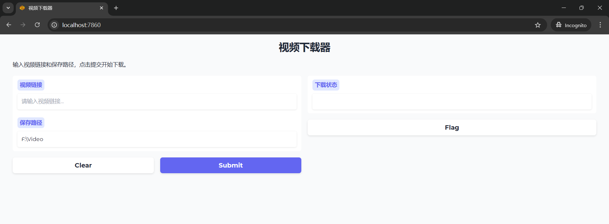

# Sloth

使用方式：

启动run.bat，会自动弹出一个下载视频的web界面，把各种视频链接放进去就行了。



# 使用修改

如果你自己使用，需要修改的内容：

`config.py`

```jsoN
# 使用字典存储配置
config = {
    'DIR': "F:\Video",
    'PROXY': 'http://127.0.0.1:4343',
}
```

改为你自己的`默认目录`和`代理（为了科学上网）`


# 支持下载平台

youtube

tiktok

哔哩哔哩

pornhub


