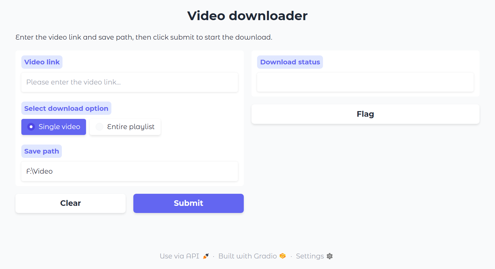

# Video Downloader

A web-based video downloader supporting YouTube, TikTok, Bilibili, Pornhub and more.



## Installation

### 1. Install Python Dependencies

```bash
pip install -r requirements.txt
```

### 2. Install FFmpeg

Download FFmpeg static binaries from [https://ffmpeg.org/download.html](https://ffmpeg.org/download.html)

Extract and place the following files in `./ffmpeg/bin/` folder:
- `ffmpeg.exe` (or `ffmpeg` on Mac/Linux)
- `ffprobe.exe` (or `ffprobe` on Mac/Linux)
- `ffplay.exe` (or `ffplay` on Mac/Linux)

### 3. Configure Settings

Edit `config.py` to set your download directory and proxy (if needed):

```python
config = {
    # Download directory (use r"" raw string to avoid escape issues)
    'DIR': r"D:\Video",

    # Proxy configuration (set to None if not needed)
    'PROXY': 'http://127.0.0.1:7890',  # or None

    # FFmpeg path (default: ./ffmpeg/bin/)
    'FFMPEG_PATH': os.path.join(".", "ffmpeg", "bin")
}
```

## Usage

**Windows:** Double-click `run.bat`

**Mac/Linux:** Run `bash run.sh` or `python app.py`

The web interface will automatically open at http://localhost:7860/

Just paste video links and click download!

## Proxy Configuration

### With Proxy (for users in Mainland China)

Due to network restrictions in Mainland China, a proxy may be required for accessing some platforms.

Edit `config.py`:

```python
config = {
    'DIR': r"F:\Video",
    'PROXY': 'http://127.0.0.1:4343',  # Your proxy address
    'FFMPEG_PATH': os.path.join(".", "ffmpeg", "bin")
}
```

### Without Proxy (for international users)

If you can directly access video platforms, set proxy to `None`:

```python
config = {
    'DIR': r"F:\Video",
    'PROXY': None,  # No proxy
    'FFMPEG_PATH': os.path.join(".", "ffmpeg", "bin")
}
```

## Supported Video Platforms

Tested and working:

- YouTube
- TikTok
- Bilibili
- Pornhub

*Note: Many other platforms are supported via yt-dlp. See [yt-dlp supported sites](https://github.com/yt-dlp/yt-dlp/blob/master/supportedsites.md)*

## Features

- Web-based GUI (no command-line needed)
- Proxy support for geo-restricted content
- Cross-platform (Windows, Mac, Linux)
- Automatic duplicate detection (won't re-download existing files)
- Best quality downloads (automatically selects best video+audio)
- Playlist support
- Custom save path configuration

